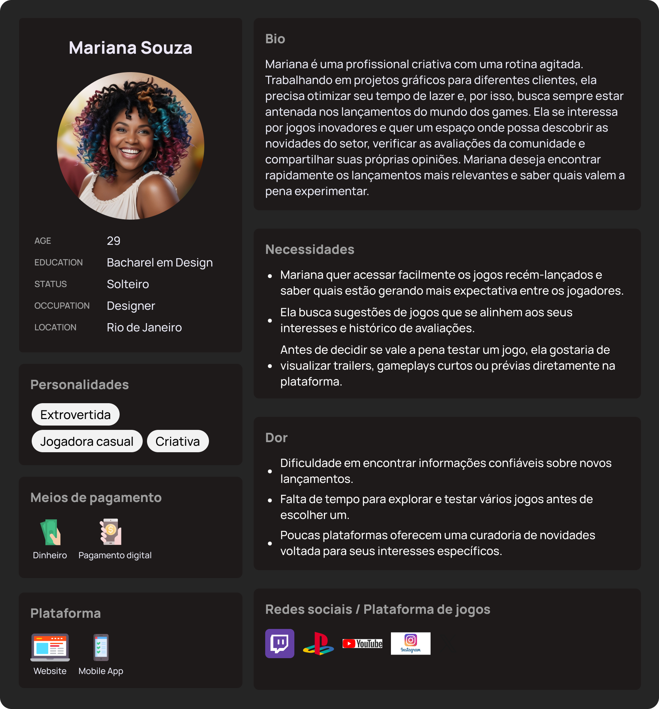

# Especificação do projeto

Esta seção apresenta uma visão geral da especificação do Game Pede, descrevendo as técnicas e ferramentas utilizadas para definir os requisitos e funcionalidades do projeto. Para isso, foram utilizadas metodologias como análise de personas, histórias de usuários e levantamento de requisitos funcionais e não funcionais. A especificação busca garantir que a plataforma atenda às necessidades dos usuários, proporcionando uma experiência intuitiva e eficiente.

## Personas

<picture>
  <source srcset="images/JoãoSilva_Dark.png" media="(prefers-color-scheme: dark)">
  <source srcset="images/JoãoSilva_Light.png" media="(prefers-color-scheme: light)">
  
</picture>

---

<picture>
  <source srcset="images/MarianaSouza_Dark.png" media="(prefers-color-scheme: dark)">
  <source srcset="images/MarianaSouza_Light.png" media="(prefers-color-scheme: light)">
  
</picture>

---

<picture>
  <source srcset="images/LucasFerreira_Dark.png" media="(prefers-color-scheme: dark)">
  <source srcset="images/LucasFerreira_Light.png" media="(prefers-color-scheme: light)">
  
</picture>

## Histórias de usuários

Com base na análise das personas, foram identificadas as seguintes histórias de usuários:

|EU COMO... | QUERO/PRECISO ...  |PARA ...                  |
|--------------------|------------------------------------|----------------------------------------|
|Usuário comum | Buscar jogos com base em avaliações | Encontrar rapidamente jogos bem avaliados|
|Usuário comum | DDeixar comentários e avaliações sobre jogos jogados | Compartilhar minha opinião com outros usuários |
|Usuário comum | Visualizar os jogos mais populares e lançamentos da semana | Descobrir novas tendências |
|Usuário registrado | Criar um perfil com minhas avaliações | Ter um histórico organizado das minhas experiências |
|Usuário avançado | Filtrar pesquisas por categorias e gêneros | Encontrar conteúdos específicos que me interessam |
|Usuário registrado | Criar e compartilhar playlists de jogos | Organizar e sugerir jogos para amigos |
|Usuário competitivo | Acompanhar notícias e atualizações de eSports | Ficar por dentro de torneios e mudanças no cenário competitivo |
|Usuário entusiasta | Assistir a trailers e gameplays curtos na plataforma | Avaliar melhor se um jogo vale a pena antes de comprá-lo |
|Criador de conteúdo | Compartilhar vídeos e transmissões ao vivo de jogos | Ampliar seu público e engajar com a comunidade |
|Usuário comum | Descobrir novos criadores de conteúdo de jogos específicos | Acompanhar vídeos e transmissões de seus jogos favoritos |

## Requisitos

As tabelas a seguir apresentam os requisitos funcionais e não funcionais que detalham o escopo do projeto. Para determinar a prioridade dos requisitos, aplique uma técnica de priorização e detalhe como essa técnica foi aplicada.

### Requisitos funcionais

|ID    | Descrição do Requisito  | Prioridade |
|------|-----------------------------------------|----|
|RF-001| Permitir que o usuário busque jogos pelo nome | ALTA | 
|RF-002| Permitir que o usuário avalie jogos com notas e comentários | ALTA |
|RF-003| Exibir jogos mais populares e bem avaliados da semana | ALTA |
|RF-004| Permitir a criação de perfis de usuários | ALTA |
|RF-005| Possibilitar filtragem de pesquisas por categorias | MÉDIA |
|RF-006| Permitir a criação e compartilhamento de playlists de jogos | MÉDIA |
|RF-007| Exibir notícias e atualizações sobre eSports | MÉDIA |
|RF-008| Incluir trailers e prévias de gameplay na plataforma | MÉDIA |
|RF-009| Permitir criadores de conteúdo compartilharem vídeos e lives | ALTA |
|RF-010| Permitir que usuários descubram criadores de conteúdo baseado em jogos de interesse | ALTA |

### Requisitos não funcionais

|ID     | Descrição do Requisito  |Prioridade |
|-------|-------------------------|----|
|RNF-001| A plataforma deve ser responsiva para dispositivos móveis | ALTA | 
|RNF-002| O tempo de resposta da busca não deve ultrapassar 2 segundos | ALTA | 
|RNF-003| Proteção dos dados dos usuários e da plataforma contra acessos não autorizados | ALTA | 
|RNF-004| O sistema deve suportar grande volume de acessos simultâneos | MÉDIA | 
|RNF-005| O sistema deve ter a opção de modo noturno | BAIXA |
|RNF-006| O sistema deve ter a opção de exibir conteúdos como lista ou blocos| BAIXA |  

Com base nas histórias de usuários, enumere os requisitos da sua solução. Classifique esses requisitos em dois grupos:

## Restrições

Enumere as restrições à sua solução. Lembre-se de que as restrições geralmente limitam a solução candidata.

O projeto está restrito aos itens apresentados na tabela a seguir.

|ID| Restrição                                             |
|--|-------------------------------------------------------|
|001| O projeto deve ser desenvolvido utilizando tecnologias web |
|002| O banco de dados deve suportar avaliações e comentários dos usuários |
|003| Deve ser desenvolvido para diferentes tipos de dispositivo |
|004| O projeto deverá ser entregue no final do semestre, até a data de 02/07/2025 |
|005| O código fonte deverá obrigatoriamente estar disponível no repositório do projeto |
|006| O site não pode ter falhas de segurança, deverá ser seguro para proteger informações mais sensíveis |

## Diagrama de casos de uso

