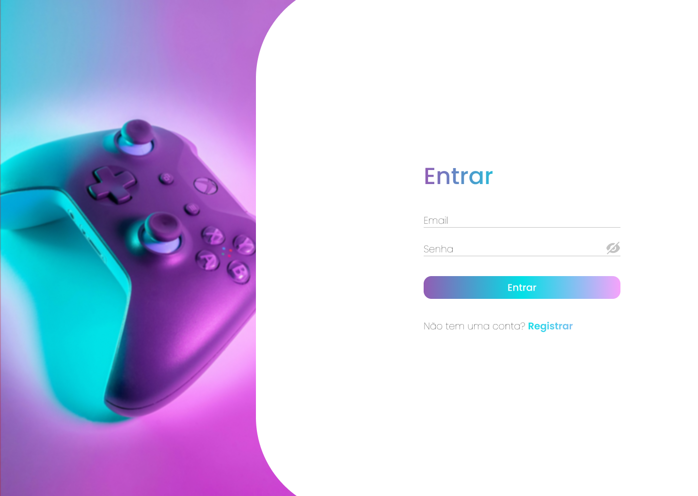
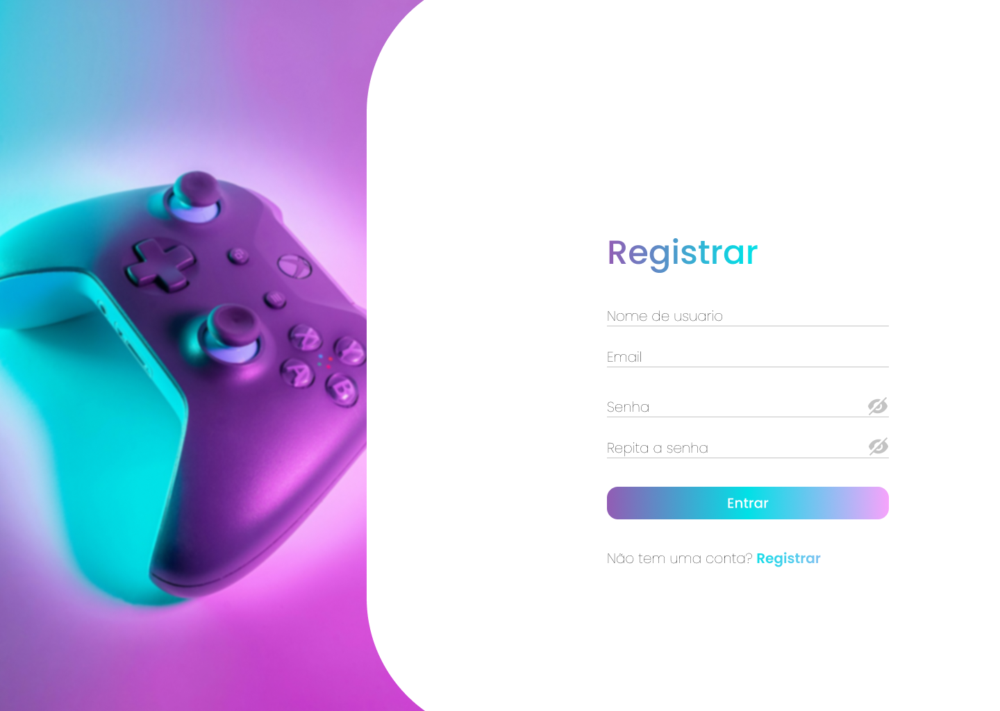
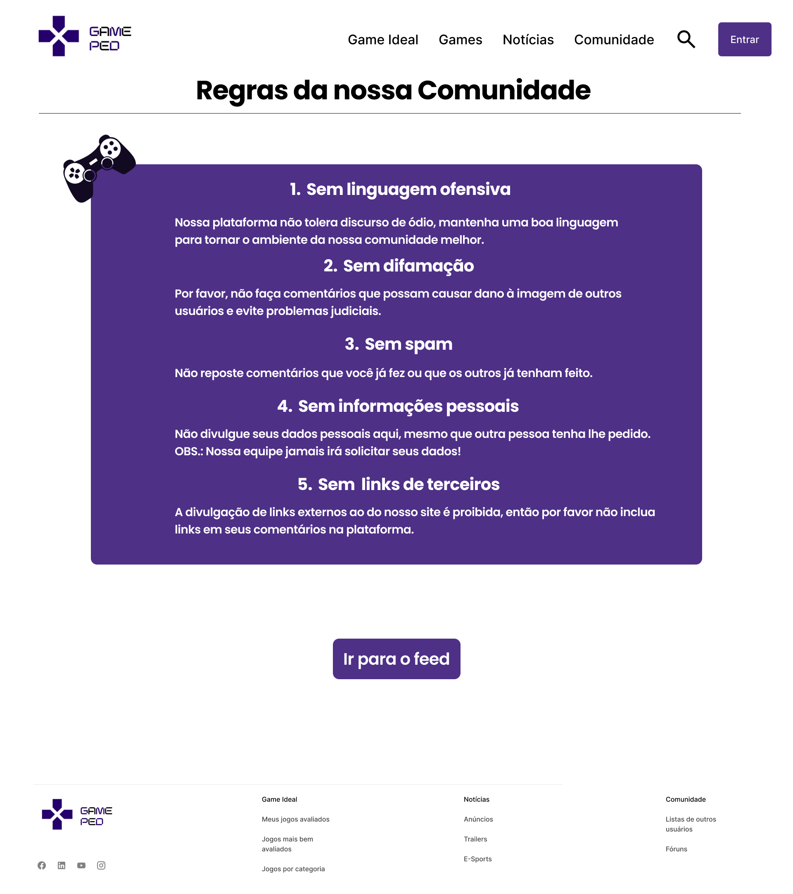
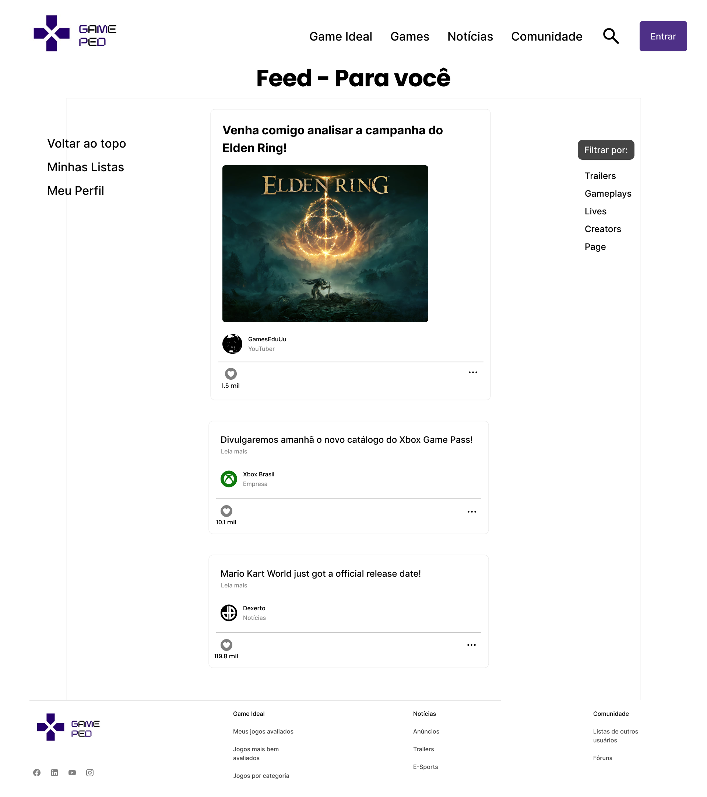

# Projeto de interface

 ## User flow

Fluxo de usuário (user flow) é uma técnica que permite ao desenvolvedor mapear todo o fluxo de navegação do usuário na aplicação. Essa técnica serve para alinhar os caminhos e as possíveis ações que o usuário pode realizar junto com os membros da equipe.

> **Links úteis**:
> - [User flow: o quê é e como fazer?](https://medium.com/7bits/fluxo-de-usu%C3%A1rio-user-flow-o-que-%C3%A9-como-fazer-79d965872534)
> - [User flow vs site maps](http://designr.com.br/sitemap-e-user-flow-quais-as-diferencas-e-quando-usar-cada-um/)
> - [Top 25 user flow tools & templates for smooth](https://www.mockplus.com/blog/post/user-flow-tools)

### Diagrama de fluxo

O diagrama apresenta o estudo do fluxo de interação do usuário com o sistema interativo, muitas vezes sem a necessidade de desenhar o design das telas da interface. Isso permite que o design das interações seja bem planejado e tenha impacto na qualidade do design do wireframe interativo que será desenvolvido logo em seguida.

O diagrama de fluxo pode ser desenvolvido com “boxes” que possuem, internamente, a indicação dos principais elementos de interface — tais como menus e acessos — e funcionalidades, como editar, pesquisar, filtrar e configurar, além da conexão entre esses boxes a partir do processo de interação.

> **Links úteis**:
> - [Como criar um diagrama de fluxo de usuário](https://www.lucidchart.com/blog/how-to-make-a-user-flow-diagram)
> - [Fluxograma online: seis sites para fazer gráfico sem instalar nada](https://www.techtudo.com.br/listas/2019/03/fluxograma-online-seis-sites-para-fazer-grafico-sem-instalar-nada.ghtml)

## Protótipos de tela

Os wireframes a seguir ilustram a estrutura e a navegação da nossa aplicação, destacando as principais funcionalidades e o design pensado para facilitar a experiência do usuário na gestão e acompanhamento do processo de exportação.

**Tela de Login**

**Tela de Registro**

**Tela Principal**

**Tela de Regras da comunidade**

**Tela do Feed**

## Interface do sistema

Visão geral da interação do usuário por meio das telas do sistema. 

> Apresente as principais interfaces da plataforma em sua versão final.
