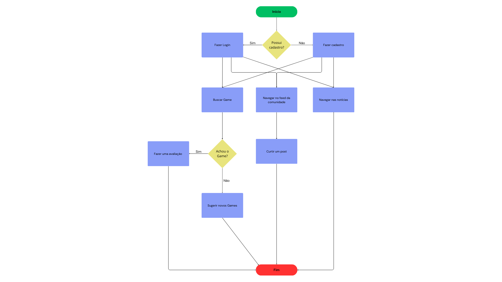
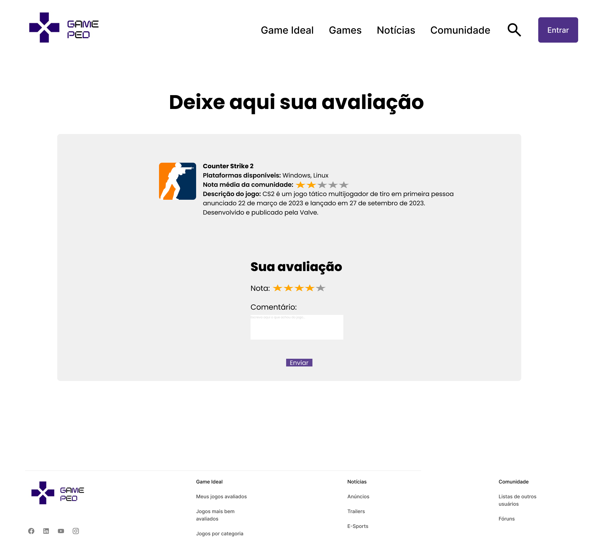

# Projeto de interface

 ## User flow

Fluxo de usuário (user flow) é uma técnica que permite ao desenvolvedor mapear todo o fluxo de navegação do usuário na aplicação. Essa técnica serve para alinhar os caminhos e as possíveis ações que o usuário pode realizar junto com os membros da equipe.

### Diagrama de fluxo

O diagrama apresenta o estudo do fluxo de interação do usuário com o sistema interativo, muitas vezes sem a necessidade de desenhar o design das telas da interface. Isso permite que o design das interações seja bem planejado e tenha impacto na qualidade do design do wireframe interativo que será desenvolvido logo em seguida.

O diagrama de fluxo pode ser desenvolvido com “boxes” que possuem, internamente, a indicação dos principais elementos de interface — tais como menus e acessos — e funcionalidades, como editar, pesquisar, filtrar e configurar, além da conexão entre esses boxes a partir do processo de interação.

## Protótipos de tela

Os wireframes a seguir ilustram a estrutura e a navegação da nossa aplicação, destacando as principais funcionalidades e o design pensado para facilitar a experiência do usuário na gestão e acompanhamento do processo de exportação.

**Tela de Login**

**Tela de Registro**

**Tela Principal**

**Tela Game Ideal**

**Tela Sugestão**

**Tela Games**

**Tela de Regras da comunidade**

**Tela do Feed**

**Tela de Comentarios e Avaliação**

**Link para o protótipo interativo no figma:**:
> https://www.figma.com/design/P72RHgUpA2DFWqFwvnFG5y/GamePede---WireFrames?node-id=0-1&t=mvC1i2TlLHJ7GU3x-1

## Interface do sistema

Visão geral da interação do usuário por meio das telas do sistema. 

### Tela Principal do Sistema

Página na qual o usuário será recebido na nossa plataforma, e poderá acessar outras páginas como games, notícias e a comunidade.

