# Plano de testes de software

<!--Pré-requisitos: <a href="02-Especificacao.md"> Especificação do projeto</a>, <a href="04-Projeto-interface.md"> Projeto de interface</a>-->

O plano de testes de software é gerado a partir da especificação do sistema e consiste em casos de teste que deverão ser executados quando a implementação estiver parcial ou totalmente pronta. Apresente os cenários de teste utilizados na realização dos testes da sua aplicação. Escolha cenários de teste que demonstrem os requisitos sendo satisfeitos.

Enumere quais cenários de testes foram selecionados para teste. Neste tópico, o grupo deve detalhar quais funcionalidades foram avaliadas, o grupo de usuários que foi escolhido para participar do teste e as ferramentas utilizadas.

Não deixe de enumerar os casos de teste de forma sequencial e garantir que o(s) requisito(s) associado(s) a cada um deles esteja(m) correto(s) — de acordo com o que foi definido na <a href="02-Especificacao.md">Especificação do projeto</a>.

Por exemplo:

| **Caso de teste**  | **CT-001 – Cadastrar perfil**  |
|:---: |:---: |
| Requisito associado | RF-004 - Permitir a criação de perfis de usuários |
| Objetivo do teste | Verificar se o usuário consegue se cadastrar na aplicação. |
| Passos | - Acessar o navegador   - https://gamepad.com/home   - Clicar em "Registrar"   - Preencher os campos obrigatórios (Nome de usuário, E-mail, Senha e Confirmar senha)   - Clicar em "Registrar" |
| Critério de êxito | - O cadastro foi realizado com sucesso. |
| Responsável pela elaboração do caso de teste | Andry Marques |
| Tela 1  | 
| Tela 2  | 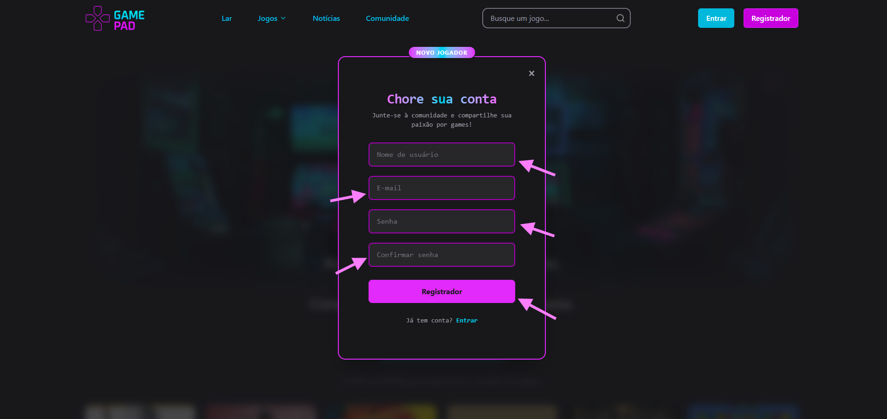
| Tela 3  | 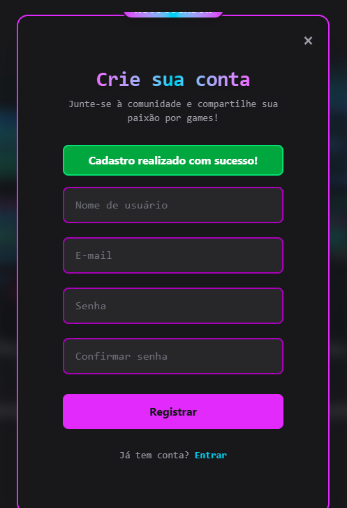

 

| **Caso de teste**  | **CT-002 – Efetuar login**  |
|:---: |:---: |
| Requisito associado | RF-006 - Permitir login do usuário |
| Objetivo do teste | Verificar se o usuário consegue realizar login. |
| Passos | - Acessar o navegador   - https://gamepad.com/home   - Clicar no botão "Entrar"   - Preencher o campo de e-mail   - Preencher o campo de senha   - Clicar em "Login" |
| Critério de êxito | - O login foi realizado com sucesso. |
| Responsável pela elaboração do caso de teste | Andry Marques |
| Tela 1  | 
| Tela 2  | 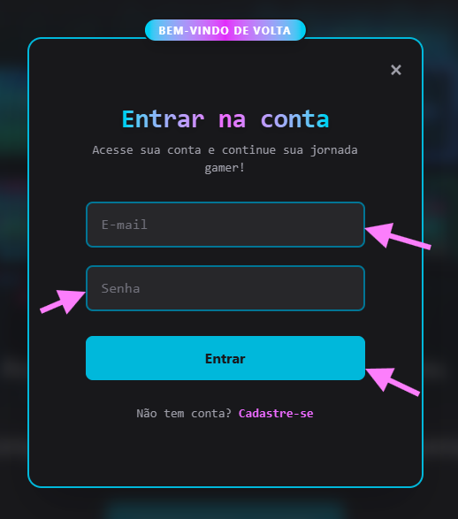
| Tela 3  | 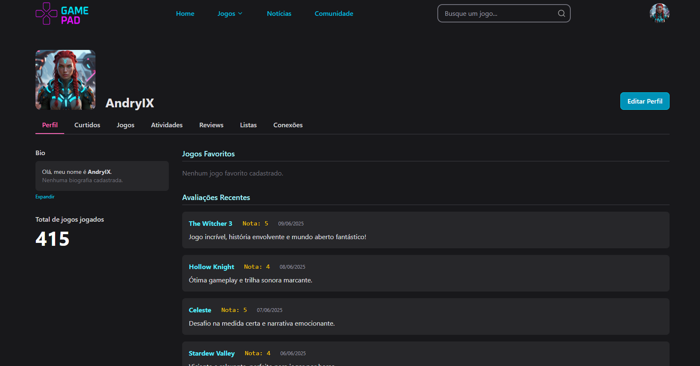

 

| **Caso de teste**  | **CT-003 – Editar perfil**  |
|:---: |:---: |
| Requisito associado | RF-008 - Permitir que usuário edite seu perfil  |
| Objetivo do teste | Verificar se o usuário consegue editar todos os campos de seu perfil. |
| Passos | - Acessar o navegador   - https://gamepad.com/   - Clicar no icone de seu perfil nocanto superior direito   - Clicar em "Meu perfil"   - Clicar em "Editar Perfil"   - Editar todos os campos possiveis do usuário. |
| Critério de êxito | - Perfil atualizado!|
| Responsável pela elaboração do caso de teste | Andry Marques |
| Tela 1  | 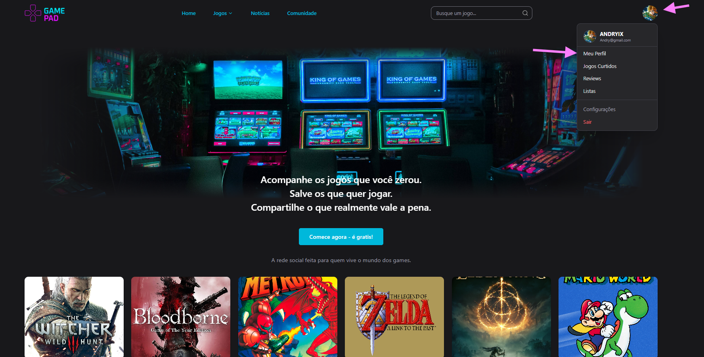
| Tela 2  | 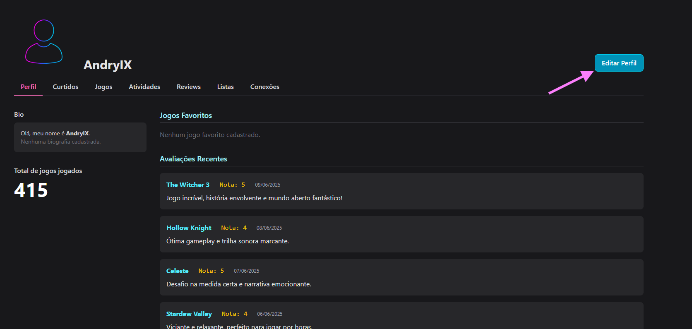
| Tela 3  | 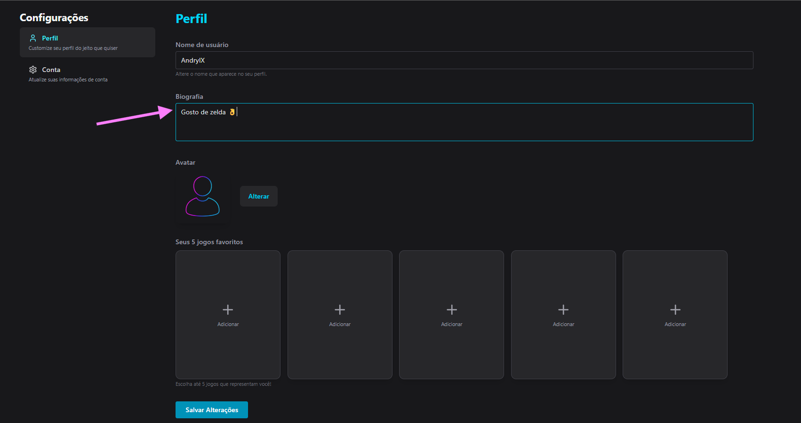
| Tela 4  | 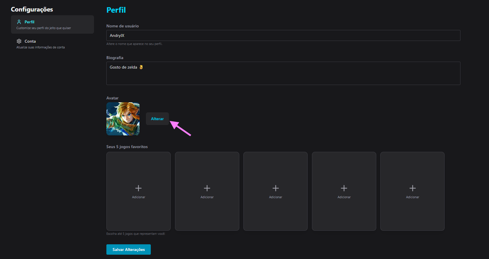
| Tela 5  | 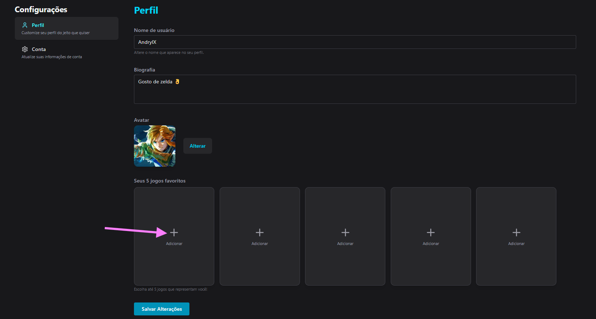
| Tela 6  | 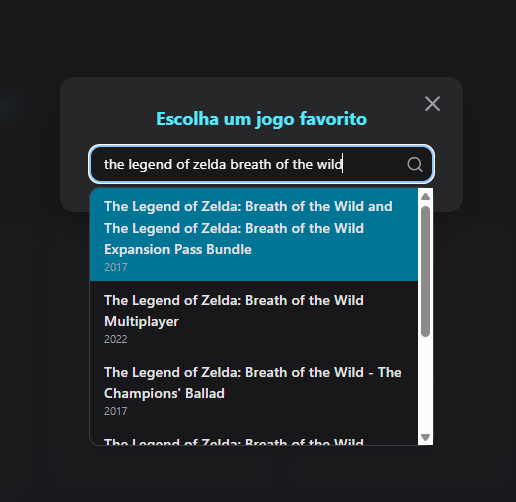
| Tela 7  | 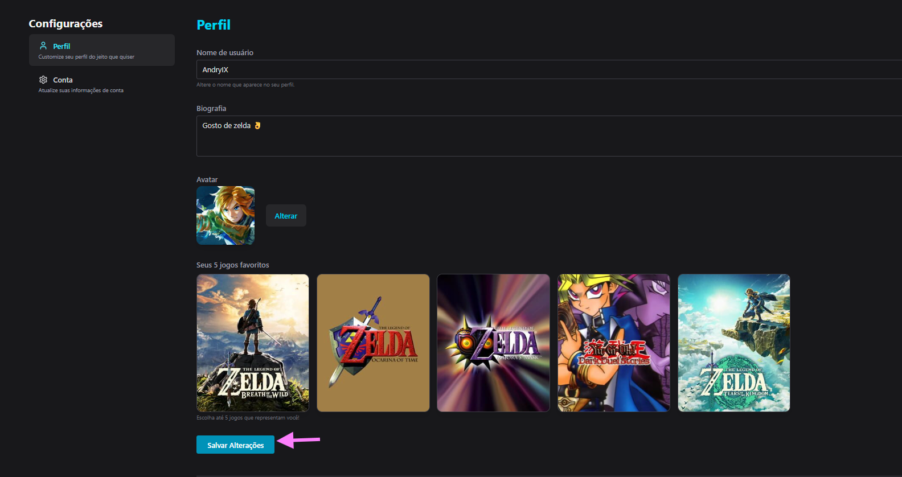
| Tela 8  | 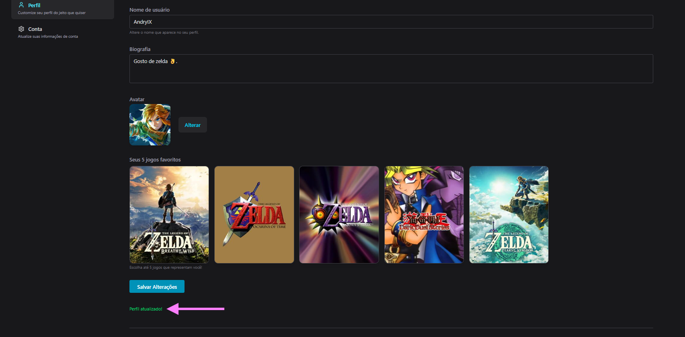

 

| **Caso de teste**  | **CT-004 – Filtrar jogos**  |
|:---: |:---: |
| Requisito associado | RF-008 - Permitir que usuário edite seu perfil  |
| Objetivo do teste | Verificar se o usuário consegue editar todos os campos de seu perfil. |
| Passos | - Acessar o navegador   - https://gamepad.com/   - Clicar no icone de seu perfil nocanto superior direito   - Clicar em "Meu perfil"   - Clicar em "Editar Perfil"   - Editar todos os campos possiveis do usuário. |
| Critério de êxito | - Perfil atualizado!|
| Responsável pela elaboração do caso de teste | Andry Marques |
| Tela 1  | 
| Tela 2  | 
| Tela 3  | 
| Tela 4  | 
| Tela 5  | 
| Tela 6  | 
| Tela 7  | 
| Tela 8  | 

## Ferramentas de testes (opcional)

Comente sobre as ferramentas de testes utilizadas.
 
> **Links úteis**:
> - [IBM - criação e geração de planos de teste](https://www.ibm.com/developerworks/br/local/rational/criacao_geracao_planos_testes_software/index.html)
> - [Práticas e técnicas de testes ágeis](http://assiste.serpro.gov.br/serproagil/Apresenta/slides.pdf)
> - [Teste de software: conceitos e tipos de testes](https://blog.onedaytesting.com.br/teste-de-software/)
> - [Criação e geração de planos de teste de software](https://www.ibm.com/developerworks/br/local/rational/criacao_geracao_planos_testes_software/index.html)
> - [Ferramentas de teste para JavaScript](https://geekflare.com/javascript-unit-testing/)
> - [UX Tools](https://uxdesign.cc/ux-user-research-and-user-testing-tools-2d339d379dc7)
