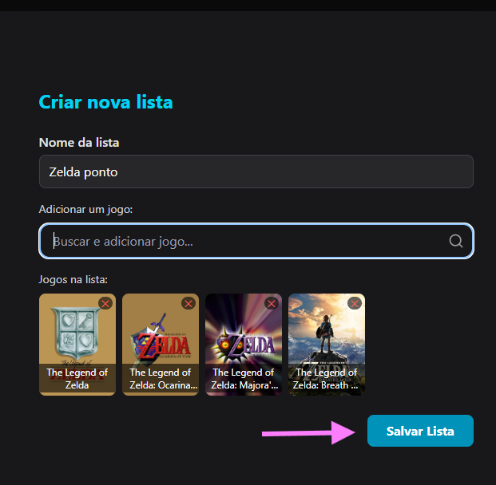

# Plano de testes de software

<!--Pré-requisitos: <a href="02-Especificacao.md"> Especificação do projeto</a>, <a href="04-Projeto-interface.md"> Projeto de interface</a>-->

Requisitos associados cê encontram em: <a href="02-Especificacao.md">Especificação do projeto</a>.

| **Caso de teste**  | **CT-001 – Cadastrar perfil**  |
|:---: |:---: |
| Requisito associado | RF-004 - Permitir a criação de perfis de usuários |
| Objetivo do teste | Verificar se o usuário consegue se cadastrar na aplicação. |
| Passos | - Acessar o navegador   - https://gamepad.com/home   - Clicar em "Registrar"   - Preencher os campos obrigatórios (Nome de usuário, E-mail, Senha e Confirmar senha)   - Clicar em "Registrar" |
| Critério de êxito | - O cadastro foi realizado com sucesso. |
| Responsável pela elaboração do caso de teste | Andry Marques |
| Tela 1  | 
| Tela 2  | 
| Tela 3  | 

 

| **Caso de teste**  | **CT-002 – Efetuar login**  |
|:---: |:---: |
| Requisito associado | RF-006 - Permitir login do usuário |
| Objetivo do teste | Verificar se o usuário consegue realizar login. |
| Passos | - Acessar o navegador   - https://gamepad.com/home   - Clicar no botão "Entrar"   - Preencher o campo de e-mail   - Preencher o campo de senha   - Clicar em "Login" |
| Critério de êxito | - O login foi realizado com sucesso. |
| Responsável pela elaboração do caso de teste | Andry Marques |
| Tela 1  | 
| Tela 2  | 
| Tela 3  | 

 

| **Caso de teste**  | **CT-003 – Editar perfil**  |
|:---: |:---: |
| Requisito associado | RF-008 - Permitir que usuário edite seu perfil  |
| Objetivo do teste | Verificar se o usuário consegue editar todos os campos de seu perfil. |
| Passos | - Acessar o navegador   - https://gamepad.com/   - Clicar no icone de seu perfil nocanto superior direito   - Clicar em "Meu perfil"   - Clicar em "Editar Perfil"   - Editar todos os campos possiveis do usuário. |
| Critério de êxito | - Perfil atualizado!|
| Responsável pela elaboração do caso de teste | Andry Marques |
| Tela 1  | 
| Tela 2  | 
| Tela 3  | 
| Tela 4  | 
| Tela 5  | 
| Tela 6  | 
| Tela 7  | 
| Tela 8  | 

 

| **Caso de teste**  | **CT-004 – Pesquisar pelo nome de seus jogos**  |
|:---: |:---: |
| Requisito associado | RF-001 - Permitir que o usuário busque jogos pelo nome |
| Objetivo do teste | Verificar se o usuário consegue pesquisar jogo por nome. |
| Passos | - Acessar o navegador   - https://gamepad.com   - Navegar até a página de games pela navbar   - Clicar em "Busque por nome de jogo"   - Clique no jogo escolhido |
| Critério de êxito | - ir para a página do jogo |
| Responsável pela elaboração do caso de teste | Andry Marques |
| Tela 1  | 
| Tela 2  | 
| Tela 3  | 

 

| **Caso de teste**  | **CT-005 – Usar os filtros de jogos**  |
|:---: |:---: |
| Requisito associado | RF-005 Possibilitar filtragem de pesquisas por categorias  |
| Objetivo do teste | Verificar se o usuário consegue usar todos os filtros na pesquisa de jogos. |
| Passos | - Acessar o navegador   - https://gamepad.com   - Navegar até a página de games pela navbar   - Clicar no inpute de Gênero   - Clicar no inpute de anos   - Clicar no inpute de Plataformas   - Clicar no inpute de Notas  

| **Caso de teste**  | **CT-006 – Filtragem das notícias**  |
|:---: |:---: |
| Requisito associado | RF-007 - Exibir notícias do mundo dos games |
| Objetivo do teste | Verificar se o usuário consegue acompanhar notícias dos games pela aplicação e se as filtragens funcionam |
| Passos | - Acessar o navegador   - https://gamepad.com/news   - Verificar se as noticias estão carregadas   - Filtrar pela plataforma   - Filtrar por jogo ou termo   - Verificar se as notícias condizem com as filtragens   - Acessar uma notícia  |
| Critério de êxito | - Filtragens corretas e acesso a notícia. |
| Responsável pela elaboração do caso de teste | Andry Marques |
| Tela 1  | 
| Tela 2  | 
| Tela 3  | 
| Tela 4  | 
| Tela 5  | 

 

| **Caso de teste**  | **CT-007 – Novas Listas**  |
|:---: |:---: |
| Requisito associado | RF-011 - Permitir que usuários crie suas listas de jogos |
| Objetivo do teste | O usuário poderá criar e editar listas de jogos |
| Passos | - Acessar o navegador   - https://gamepad.com   - Ir em "Meu Perfil"   - Ir em "Listas"   - "Nova Lista" ou "Editar Lista"   - Criar o nome e definir os jogos da lista   - Salvar  |
| Critério de êxito | - Verificar se o usuário consegue seguir este fluxo |
| Responsável pela elaboração do caso de teste | Andry Marques |
| Tela 1  | 
| Tela 2  | 
| Tela 3  | 
| Tela 4  | 
| Tela 5  | 
| Tela 6  | 

 

| **Caso de teste**  | **CT-008 – Reviews**  |
|:---: |:---: |
| Requisito associado | RF-002 - Permitir que o usuário avalie jogos com notas e comentários |
| Objetivo do teste | Verificar se o usuário dar notas e fazer comentários em jogos |
| Passos |- https://gamepad.com/games   - Selecionar o jogo no qual ele quer avaliar   - Clicar em fazer review   - Preencher os campos que ela quiser   - Clicar em "Salvar Review" |
| Critério de êxito | - Comentário salvo e aparece na página do jogo |
| Responsável pela elaboração do caso de teste | Andry Marques |
| Tela 1  | 
| Tela 2  | 
| Tela 3  | 
| Tela 4  | 

<!--## Ferramentas de testes (opcional)

Comente sobre as ferramentas de testes utilizadas.
 
> **Links úteis**:
> - [IBM - criação e geração de planos de teste](https://www.ibm.com/developerworks/br/local/rational/criacao_geracao_planos_testes_software/index.html)
> - [Práticas e técnicas de testes ágeis](http://assiste.serpro.gov.br/serproagil/Apresenta/slides.pdf)
> - [Teste de software: conceitos e tipos de testes](https://blog.onedaytesting.com.br/teste-de-software/)
> - [Criação e geração de planos de teste de software](https://www.ibm.com/developerworks/br/local/rational/criacao_geracao_planos_testes_software/index.html)
> - [Ferramentas de teste para JavaScript](https://geekflare.com/javascript-unit-testing/)
> - [UX Tools](https://uxdesign.cc/ux-user-research-and-user-testing-tools-2d339d379dc7)-->
